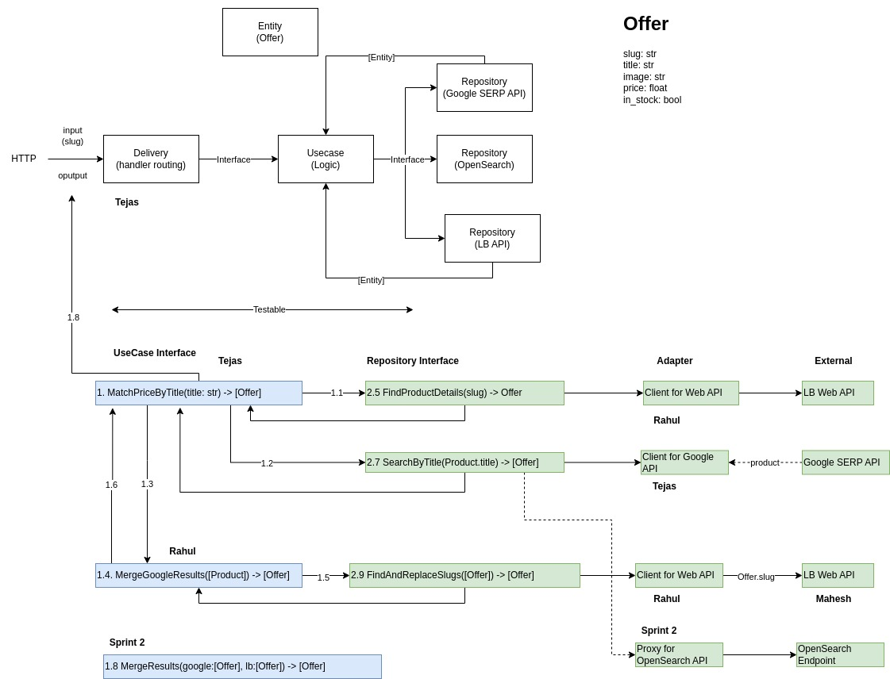
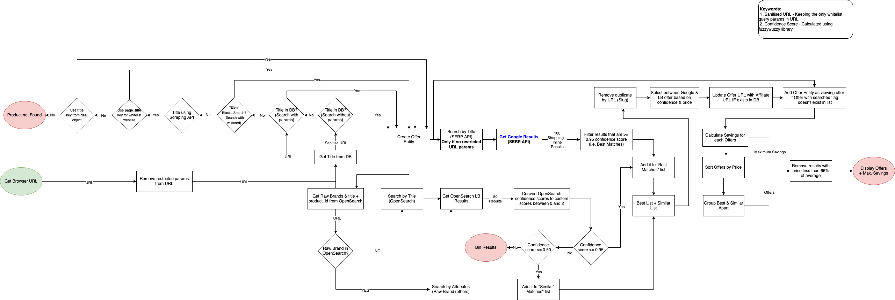
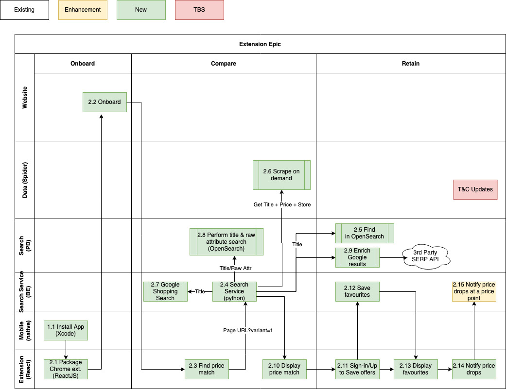

# Search Service

# Background
This is a public facing service that provides search for Little Birdie products.

## Supported use cases

* Price matching service for Little Birdie search using HTTP REST.

# Approach

The service repo is based on a **Clean Architecture** approach. This approach segregates
the code for the application into business logic, repositories (reading, writing of data) and
delivery layer (REST, GraphQL, CLI). 

The data must be exchanged between these layers using well-defined entities.

The intent is to make development easier and maintenance easier over time.

# Linting
This project assumes that you are using vscode with `pylint` as linting tool. `.pylintrc` contains setting for successful execution of pylint in your project.
Please do not change or update this file.

# Project Setup
Clone above project and follow below steps to start project.

1. Open terminal and go to project home directory

2. Install `virtualenv` : this is to unsure that we are safekeeping all our environment realted libraries inside the project environment and not conflicting with system related project settings.
  `pip3 install virtualenv`

3. Create virtual environment
  `virtualenv env`

4. Activate environment.
  `source ./env/bin/activate`

5. Install required libraries FastAPI:
  `pip3 install -r requirements.txt`

6. Start service:
  `make run-local`
   OR
  import pycharm run config from `docs/.run_pycharm_local_search_api`

7. Open browser to load url http://127.0.0.1:8000 to see json response "{Hello: World!}"

Once server is started you can view the API documentation on below url:
`http://localhost:8000/docs`

# Branching strategy
1. Branch off from main
2. Modify your branch
3. Merge your branch with UAT (uat branch)
4. Test changes
5. Send PR to merge with pre production (pprod branch)
6. Test changes using pre production
7. Raise PR to merge changes (Feature branch) to the `main` branch

# Other Flowcharts and documentations
> ### View / Update the Flowchart in the Confluence Page - [Middleware Flowchart](https://littlebirdie.atlassian.net/wiki/spaces/LB/pages/3217850369/Middleware+Flowchart)

## Offer match complete flowchart

## High Level Architecture

